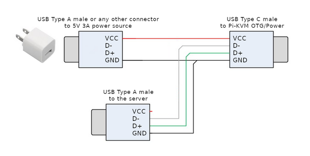

<!-- TOC -->

- [KVMD port for non raspberry pi](#kvmd-port-for-non-raspberry-pi)
    - [Installation](#installation)
    - [Notes](#notes)
        - [To self](#to-self)
    - [References](#references)

<!-- /TOC -->

## KVMD port for non raspberry pi
The script is simple, so if you want to port to other devices, please adjust accordingly.  
Please help this project to make pikvm available to other SBCs.  

### Installation
```bash
rm /etc/apt/sources.list.d/armbian.list
apt update && apt install -y git
git clone https://github.com/finzzz/kvmd
cd kvmd && ./install.sh
```

### Notes
- Using Armbian_22.11.1_Nanopineo2_jammy_current_5.15.80_minimal.img
- Tested on nanopi neo 2 with HDMI-USB
- Running KVMD 3.191 (Python 3.10)

#### To self
- Must run resize2fs when importing image
```
resize2fs /dev/mmcblk0p1
```
- Y splitter wiring  


### References
- https://github.com/xe5700/kvmd-armbian
- https://github.com/hzyitc/kvmd-debian